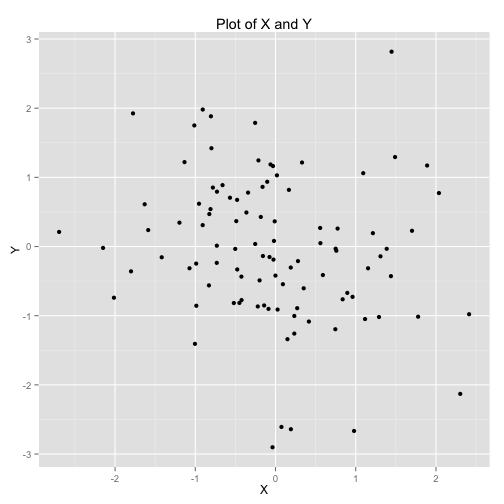
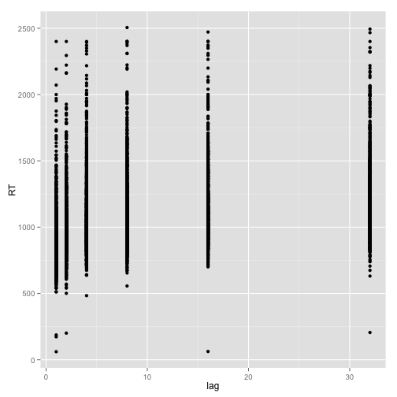
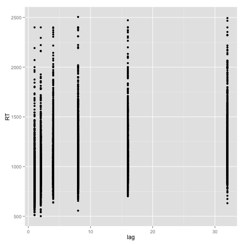
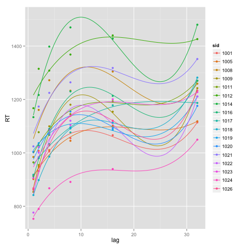
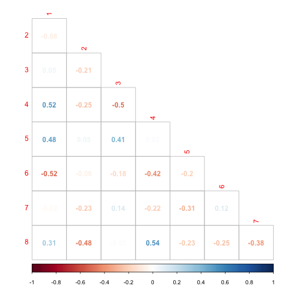
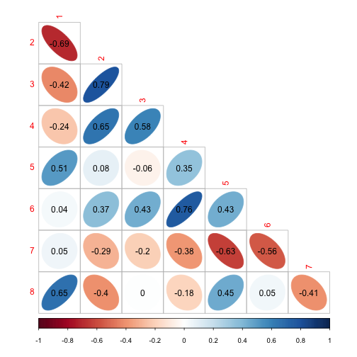

Data Analysis in R and ggplot2
========================================================
author: Bradley Buchsbaum
date: 03/12/2014
transition: rotate


Rotman Research Institute, Baycrest


Goals of the workshop
========================================================

- **Learn** how to get started with interactive plotting.

- **Learn** how to transform and summarize data effectively.

- **Learn** about different ways of visualizing data to maximize beauty *and* interpretability.


Note: This presentation was made in RStudio
https://www.rstudio.com/


Why R?
========================================================
- **R** is an excellent tool for data manipulation and plotting.

- **R** is interactive and flexible.

- There are many learning resoruces available for **R**.

- **R** is widely used in statistics and data science.

- **R** is free

- **R** can be hard, but it's worth the effort.

Valuable 'R' Resources on the Web
========================================================
- Main R site: http://cran.r-project.org
- Stack overflow: http://stackoverflow.com
- Roger Peng's Coursera course on R https://www.coursera.org/course/rprog 
- **ggplot2** homepage http://ggplot2.org/
- **R** Graphics Cookbook,by Winston Chang


Some Alternatives to R for Interactive Data Visualization
========================================================
- Python (**yhat**, **IPython**, **Bokeh**)
- Matlab
- javascript (**D3**, **vega**)
- Julia (new kid on block)
- Excel? no.

Do I need to learn how to "program" for this?
========================================================

- You already know how to "program". 
- You **do** need to learn a little *syntax*
- You'll get enough syntax today to make nice plots in R.
- The more you work with R, the more accustomed you'll get to the syntax.

Spreadsheet programs
========================================================
Here is where I tell you that spreadsheets are the enemy.

**Join the war against spreadsheets.**

Spreadsheets are good for a budget. Neat color coding, simple tables,
keeping track of semi-structured information (planning a wedding, "The Bachelor" betting pools, next summer's trip to Europe, etc.)

If you need to use spreadsheets for data:
- keep them tabular
- do *not* put spaces in variable names
- always convert to plain text whenever exchanging information with a spreadsheet hater.

Getting started with R and ggplot2
========================================================

- Download **R** from CRAN 
- (optional but recommended) Download **Rstudio**
- install **ggplot2**
- from R console type:

```r
install.packages("ggplot2")
```

- or from **RStudio** Menu Tools/Install Packages ...

Getting Data in to R
=======================================================

In R, the easiest way to import data is with the function `read.table`

`read.table` is a very flexible function to read tabular plain text files.

- For `read.table` to work, the data must be regular. No missing cells.
- If you have an empty cell, replace it with `NA`.
- cells are usually separated by spaces, tabs, or commas.
- the first row of the table is typically used for column names.
- `read.table` will fail if not all rows have the same number of entries.
- if you need spaces in a cell, put all values for that column in quotes.
- if you have a repeated measures variable, prefer a single column + indicator variable for the repeated measure(s).

Reading an Example Data File
=======================================================
First, we create an example data set.


```r
age <- c(25,37,23,22,18,23,44,66,91)
height <- c(175,145,166,178,166,126,166,124,133)
sex <- c("M", "M", "F", "F", "F", "M", "M", "F", "M")

df1 <- data.frame(age=age, height=height, sex=sex)
write.table(df1, "mydata.txt")
read.table("mydata.txt")
```

```
  age height sex
1  25    175   M
2  37    145   M
3  23    166   F
4  22    178   F
5  18    166   F
6  23    126   M
7  44    166   M
8  66    124   F
9  91    133   M
```


Working with Data Frames
=======================================================
When you read a data file with `read.table` it *returns* an R `data.frame`

**R** `data.frame`s are stuctures for storing and accessing tabular data.

Note: you can also read .xlsx files with `read.xlsx` from xslx package.


```r
df1 <- read.table("mydata.txt", header=TRUE)
df1$age
```

```
[1] 25 37 23 22 18 23 44 66 91
```

```r
df1[["age"]]
```

```
[1] 25 37 23 22 18 23 44 66 91
```

```r
x <- df1$age
mean(x)
```

```
[1] 38.78
```


Making basic plots in R using the default graphics system
=========================================================

lets plot two random normally distributed variables:


```r
x <- rnorm(100)
y <- rnorm(100)
plot(x,y)
text(0,0, "hello", col="red", cex=5)
points(rnorm(100), rnorm(100), col="blue")
```


Making a simple plot with ggplot2
=========================================================

```r
library(ggplot2)
x <- rnorm(100)
y <- rnorm(100)
qplot(x,y) + labs(x="X", y="Y", title="Plot of X and Y")
```



Increasing the base font size
=========================================================

```r
library(ggplot2)
theme_set(theme_grey(base_size = 24)) 
x <- rnorm(100)
y <- rnorm(100)
qplot(x,y) 
```


An extended example with a real dataset
=======================================

We will be using a file called **recogmem.txt**

- Data comes from a recognition memory experiment.
- There are three main independent variables: **repnum**, **lag**, and **word_status**
- There are two dependent variables: **correct** and *RT*


```r
df1 <- read.table("recogmem.txt", header=TRUE)
names(df1)
```

```
 [1] "word_id"     "word_status" "repnum"      "repstatus"   "run"        
 [6] "lag"         "correct"     "RT"          "crossrun"    "sid"        
```


A Schematic of recognition memory study design
=======================================
` `


An extended example with a real dataset
=======================================
title: false


```r
df1 <- read.table("recogmem.txt", header=TRUE)
df1$sid[1:5]
```

```
[1] 1001 1001 1001 1001 1001
```

```r
df1$sid <- factor(df1$sid)
length(levels(df1$sid))
```

```
[1] 17
```

```r
levels(df1$word_status)
```

```
[1] "pseudo" "real"  
```

```r
unique(df1$lag)
```

```
[1]  0  4  1  8  2 32 16
```

```r
unique(df1$repnum)
```

```
[1] 1 2 3 4 5 6 7
```


Computing some summary stats
=======================================
title: false


```r
### install.packages("doBy")
library(doBy)
dfsum <- summaryBy(RT ~ repnum, data=df1)
dfsum
```

```
  repnum RT.mean
1      1    1423
2      2    1243
3      3    1157
4      4    1140
5      5    1086
6      6    1067
7      7    1047
```

```r

```


Computing some summary stats (mean)
=======================================
title: false


```r
### install.packages("doBy")
library(doBy)
dfsum <- summaryBy(RT ~ repnum, data=df1, FUN=median)
dfsum
```

```
  repnum RT.median
1      1    1342.9
2      2    1169.9
3      3    1089.1
4      4    1067.0
5      5    1023.2
6      6     999.9
7      7     980.9
```


Computing some summary stats (median)
=======================================
title: false


```r
### install.packages("doBy")
library(doBy)
dfsum <- summaryBy(RT ~ repnum, data=df1, FUN=median)
dfsum
```

```
  repnum RT.median
1      1    1342.9
2      2    1169.9
3      3    1089.1
4      4    1067.0
5      5    1023.2
6      6     999.9
7      7     980.9
```


Computing some summary stats (split by subjects)
=======================================
title: false


```r
### install.packages("doBy")
library(doBy)
dfsum <- summaryBy(RT ~ repnum + sid, data=df1)
dfsum
```

```
    repnum  sid RT.mean
1        1 1001  1239.5
2        1 1005  1406.0
3        1 1008  1347.1
4        1 1009  1223.8
5        1 1011  1409.7
6        1 1012  1578.8
7        1 1014  1661.0
8        1 1016  1336.4
9        1 1017  1259.7
10       1 1018  1464.6
11       1 1019  1349.3
12       1 1020  1519.1
13       1 1021  1814.5
14       1 1022  1384.7
15       1 1023  1462.4
16       1 1024  1294.4
17       1 1026  1450.7
18       2 1001  1199.3
19       2 1005  1120.6
20       2 1008  1329.2
21       2 1009  1187.4
22       2 1011  1244.7
23       2 1012  1455.3
24       2 1014  1454.3
25       2 1016  1221.4
26       2 1017  1269.6
27       2 1018  1192.1
28       2 1019  1132.2
29       2 1020  1219.4
30       2 1021  1383.3
31       2 1022  1241.2
32       2 1023  1270.7
33       2 1024  1065.2
34       2 1026  1145.8
35       3 1001  1011.1
36       3 1005  1027.0
37       3 1008  1238.1
38       3 1009  1082.2
39       3 1011  1205.4
40       3 1012  1388.6
41       3 1014  1390.4
42       3 1016  1191.4
43       3 1017  1130.3
44       3 1018  1117.1
45       3 1019  1143.0
46       3 1020  1092.3
47       3 1021  1259.3
48       3 1022  1192.6
49       3 1023  1121.7
50       3 1024   919.1
51       3 1026  1151.5
52       4 1001  1099.4
53       4 1005  1051.8
54       4 1008  1255.5
55       4 1009  1052.3
56       4 1011  1102.3
57       4 1012  1392.8
58       4 1014  1500.7
59       4 1016  1132.0
60       4 1017  1077.5
61       4 1018  1029.8
62       4 1019  1054.5
63       4 1020  1240.0
64       4 1021  1277.0
65       4 1022  1121.8
66       4 1023  1108.3
67       4 1024   880.3
68       4 1026  1023.0
69       5 1001   994.8
70       5 1005   997.1
71       5 1008  1113.0
72       5 1009  1110.3
73       5 1011  1108.6
74       5 1012  1344.4
75       5 1014  1289.4
76       5 1016  1078.1
77       5 1017  1089.8
78       5 1018   992.5
79       5 1019  1063.8
80       5 1020  1146.1
81       5 1021  1184.7
82       5 1022   985.1
83       5 1023  1084.0
84       5 1024   815.1
85       5 1026  1091.8
86       6 1001  1089.5
87       6 1005   963.6
88       6 1008  1180.9
89       6 1009  1048.4
90       6 1011  1030.5
91       6 1012  1242.3
92       6 1014  1293.9
93       6 1016  1059.0
94       6 1017  1118.7
95       6 1018   952.7
96       6 1019  1062.6
97       6 1020  1012.3
98       6 1021  1230.9
99       6 1022  1015.2
100      6 1023  1002.3
101      6 1024   820.3
102      6 1026  1039.4
103      7 1001  1023.0
104      7 1005   960.7
105      7 1008  1140.4
106      7 1009  1094.9
107      7 1011  1022.1
108      7 1012  1243.6
109      7 1014  1306.1
110      7 1016  1059.3
111      7 1017  1001.1
112      7 1018   924.4
113      7 1019  1061.0
114      7 1020  1035.4
115      7 1021  1196.2
116      7 1022   960.1
117      7 1023  1027.3
118      7 1024   790.8
119      7 1026   969.5
```


Computing some summary stats (lag and repnum)
=======================================
title: false


```r
### install.packages("doBy")
library(doBy)
dfsum <- summaryBy(RT ~ repnum + lag, data=df1)
dfsum
```

```
   repnum lag RT.mean
1       1   0  1423.4
2       2   1  1003.6
3       2   2  1189.6
4       2   4  1204.8
5       2   8  1272.4
6       2  16  1343.3
7       2  32  1430.3
8       3   1   956.6
9       3   2  1076.1
10      3   4  1135.5
11      3   8  1237.8
12      3  16  1211.2
13      3  32  1313.4
14      4   1   955.3
15      4   2   988.8
16      4   4  1182.3
17      4   8  1180.3
18      4  16  1189.7
19      4  32  1293.0
20      5   1   924.2
21      5   2  1015.8
22      5   4  1029.4
23      5   8  1133.6
24      5  16  1135.5
25      5  32  1237.6
26      6   1   903.8
27      6   2  1000.8
28      6   4  1123.3
29      6   8  1103.6
30      6  16  1094.4
31      6  32  1187.0
32      7   1   919.7
33      7   2   968.0
34      7   4  1091.8
35      7   8  1097.0
36      7  16  1135.3
37      7  32  1101.4
```


Computing some summary stats (lag and repnum and sid)
=======================================
title: false


```r
### install.packages("doBy")
library(doBy)
dfsum <- summaryBy(RT ~ repnum + lag + sid, data=df1)
dfsum
```

```
    repnum lag  sid RT.mean
1        1   0 1001  1239.5
2        1   0 1005  1406.0
3        1   0 1008  1347.1
4        1   0 1009  1223.8
5        1   0 1011  1409.7
6        1   0 1012  1578.8
7        1   0 1014  1661.0
8        1   0 1016  1336.4
9        1   0 1017  1259.7
10       1   0 1018  1464.6
11       1   0 1019  1349.3
12       1   0 1020  1519.1
13       1   0 1021  1814.5
14       1   0 1022  1384.7
15       1   0 1023  1462.4
16       1   0 1024  1294.4
17       1   0 1026  1450.7
18       2   1 1001   957.2
19       2   1 1005   970.5
20       2   1 1008  1064.6
21       2   1 1009   971.9
22       2   1 1011  1048.8
23       2   1 1012  1227.7
24       2   1 1014  1070.4
25       2   1 1016   986.9
26       2   1 1017   983.8
27       2   1 1018   919.7
28       2   1 1019  1058.0
29       2   1 1020  1100.7
30       2   1 1021  1052.0
31       2   1 1022   788.6
32       2   1 1023  1004.9
33       2   1 1024   871.5
34       2   1 1026  1024.5
35       2   2 1001  1560.9
36       2   2 1005  1016.7
37       2   2 1008  1297.6
38       2   2 1009  1076.8
39       2   2 1011  1204.5
40       2   2 1012  1392.8
41       2   2 1014  1331.2
42       2   2 1016  1087.6
43       2   2 1017  1304.3
44       2   2 1018   996.8
45       2   2 1019  1100.5
46       2   2 1020  1223.7
47       2   2 1021  1238.7
48       2   2 1022  1111.1
49       2   2 1023  1190.5
50       2   2 1024  1000.5
51       2   2 1026  1000.8
52       2   4 1001  1130.6
53       2   4 1005  1205.6
54       2   4 1008  1532.8
55       2   4 1009  1186.3
56       2   4 1011  1190.0
57       2   4 1012  1614.1
58       2   4 1014  1232.9
59       2   4 1016  1119.6
60       2   4 1017   978.9
61       2   4 1018   938.4
62       2   4 1019  1075.0
63       2   4 1020  1271.8
64       2   4 1021  1288.8
65       2   4 1022  1177.8
66       2   4 1023  1261.5
67       2   4 1024  1205.0
68       2   4 1026  1106.4
69       2   8 1001  1140.7
70       2   8 1005  1213.1
71       2   8 1008  1368.7
72       2   8 1009  1255.2
73       2   8 1011  1216.7
74       2   8 1012  1436.9
75       2   8 1014  1477.1
76       2   8 1016  1526.7
77       2   8 1017  1175.2
78       2   8 1018  1376.2
79       2   8 1019  1128.7
80       2   8 1020  1234.6
81       2   8 1021  1334.1
82       2   8 1022  1381.1
83       2   8 1023  1223.2
84       2   8 1024  1035.6
85       2   8 1026  1150.3
86       2  16 1001  1254.2
87       2  16 1005  1242.8
88       2  16 1008  1403.6
89       2  16 1009  1074.0
90       2  16 1011  1322.1
91       2  16 1012  1623.3
92       2  16 1014  1778.9
93       2  16 1016  1334.6
94       2  16 1017  1360.5
95       2  16 1018  1431.9
96       2  16 1019  1156.9
97       2  16 1020  1274.0
98       2  16 1021  1606.2
99       2  16 1022  1281.1
100      2  16 1023  1319.4
101      2  16 1024  1118.4
102      2  16 1026  1290.5
103      2  32 1001  1196.2
104      2  32 1005  1130.7
105      2  32 1008  1388.3
106      2  32 1009  1544.9
107      2  32 1011  1448.1
108      2  32 1012  1527.4
109      2  32 1014  1764.1
110      2  32 1016  1282.0
111      2  32 1017  1607.1
112      2  32 1018  1452.8
113      2  32 1019  1248.2
114      2  32 1020  1224.7
115      2  32 1021  1668.9
116      2  32 1022  1575.9
117      2  32 1023  1535.1
118      2  32 1024  1138.1
119      2  32 1026  1259.3
120      3   1 1001   795.3
121      3   1 1005   908.9
122      3   1 1008  1093.2
123      3   1 1009   852.8
124      3   1 1011   961.2
125      3   1 1012  1256.6
126      3   1 1014  1187.1
127      3   1 1016   986.9
128      3   1 1017   950.8
129      3   1 1018   848.9
130      3   1 1019  1033.4
131      3   1 1020  1025.0
132      3   1 1021  1023.7
133      3   1 1022   765.8
134      3   1 1023   958.2
135      3   1 1024   809.1
136      3   1 1026   852.3
137      3   2 1001   962.9
138      3   2 1005  1074.5
139      3   2 1008  1219.1
140      3   2 1009  1010.7
141      3   2 1011  1206.8
142      3   2 1012  1265.2
143      3   2 1014  1114.5
144      3   2 1016  1042.5
145      3   2 1017  1145.6
146      3   2 1018   974.6
147      3   2 1019  1039.4
148      3   2 1020   937.3
149      3   2 1021  1237.0
150      3   2 1022  1356.5
151      3   2 1023   998.9
152      3   2 1024   796.0
153      3   2 1026   957.7
154      3   4 1001   939.4
155      3   4 1005  1028.4
156      3   4 1008  1276.1
157      3   4 1009  1070.0
158      3   4 1011  1206.9
159      3   4 1012  1253.0
160      3   4 1014  1343.2
161      3   4 1016  1192.6
162      3   4 1017  1092.5
163      3   4 1018   962.2
164      3   4 1019  1093.5
165      3   4 1020  1042.0
166      3   4 1021  1300.1
167      3   4 1022  1103.0
168      3   4 1023  1114.9
169      3   4 1024   847.8
170      3   4 1026  1386.2
171      3   8 1001  1201.6
172      3   8 1005   954.5
173      3   8 1008  1179.2
174      3   8 1009  1241.2
175      3   8 1011  1203.5
176      3   8 1012  1415.6
177      3   8 1014  1793.2
178      3   8 1016  1245.8
179      3   8 1017  1095.9
180      3   8 1018  1327.4
181      3   8 1019  1165.3
182      3   8 1020  1256.0
183      3   8 1021  1270.6
184      3   8 1022  1450.6
185      3   8 1023  1129.8
186      3   8 1024   939.7
187      3   8 1026  1153.7
188      3  16 1001  1073.5
189      3  16 1005   996.6
190      3  16 1008  1371.2
191      3  16 1009  1085.1
192      3  16 1011  1288.7
193      3  16 1012  1577.7
194      3  16 1014  1326.0
195      3  16 1016  1222.1
196      3  16 1017  1235.0
197      3  16 1018  1063.4
198      3  16 1019  1143.1
199      3  16 1020  1099.8
200      3  16 1021  1163.5
201      3  16 1022  1218.0
202      3  16 1023  1355.9
203      3  16 1024  1052.6
204      3  16 1026  1167.9
205      3  32 1001  1085.5
206      3  32 1005  1109.0
207      3  32 1008  1218.6
208      3  32 1009  1229.5
209      3  32 1011  1333.4
210      3  32 1012  1544.7
211      3  32 1014  1591.9
212      3  32 1016  1427.4
213      3  32 1017  1243.7
214      3  32 1018  1605.9
215      3  32 1019  1395.2
216      3  32 1020  1196.7
217      3  32 1021  1531.7
218      3  32 1022  1161.3
219      3  32 1023  1329.7
220      3  32 1024  1173.3
221      3  32 1026  1510.3
222      4   1 1001   847.4
223      4   1 1005   885.0
224      4   1 1008  1076.6
225      4   1 1009   866.2
226      4   1 1011   924.4
227      4   1 1012  1049.9
228      4   1 1014  1342.2
229      4   1 1016   971.0
230      4   1 1017   892.3
231      4   1 1018   920.9
232      4   1 1019   987.0
233      4   1 1020   987.4
234      4   1 1021  1124.3
235      4   1 1022   901.5
236      4   1 1023   912.9
237      4   1 1024   710.0
238      4   1 1026   819.6
239      4   2 1001   969.3
240      4   2 1005   882.6
241      4   2 1008  1067.2
242      4   2 1009   849.5
243      4   2 1011  1019.3
244      4   2 1012  1305.1
245      4   2 1014  1194.7
246      4   2 1016   883.4
247      4   2 1017   918.1
248      4   2 1018   797.7
249      4   2 1019   997.7
250      4   2 1020   991.8
251      4   2 1021  1458.5
252      4   2 1022   905.8
253      4   2 1023  1006.6
254      4   2 1024   712.6
255      4   2 1026   821.4
256      4   4 1001  1073.1
257      4   4 1005  1080.2
258      4   4 1008  1372.3
259      4   4 1009  1355.0
260      4   4 1011  1053.4
261      4   4 1012  1491.7
262      4   4 1014  1479.0
263      4   4 1016  1071.0
264      4   4 1017  1081.9
265      4   4 1018  1024.9
266      4   4 1019  1045.4
267      4   4 1020  1558.8
268      4   4 1021  1404.0
269      4   4 1022  1129.3
270      4   4 1023   989.4
271      4   4 1024   858.8
272      4   4 1026  1155.6
273      4   8 1001  1166.4
274      4   8 1005  1085.9
275      4   8 1008  1253.0
276      4   8 1009  1009.4
277      4   8 1011  1097.3
278      4   8 1012  1530.9
279      4   8 1014  1481.9
280      4   8 1016  1413.0
281      4   8 1017  1039.6
282      4   8 1018   964.9
283      4   8 1019  1043.4
284      4   8 1020  1233.4
285      4   8 1021  1317.7
286      4   8 1022  1385.6
287      4   8 1023  1123.3
288      4   8 1024   877.1
289      4   8 1026  1060.4
290      4  16 1001  1244.5
291      4  16 1005  1135.6
292      4  16 1008  1228.0
293      4  16 1009  1247.6
294      4  16 1011  1244.0
295      4  16 1012  1314.2
296      4  16 1014  1929.5
297      4  16 1016  1123.1
298      4  16 1017  1221.0
299      4  16 1018  1086.2
300      4  16 1019  1032.2
301      4  16 1020  1194.2
302      4  16 1021  1176.8
303      4  16 1022  1092.7
304      4  16 1023  1238.0
305      4  16 1024   947.5
306      4  16 1026   992.8
307      4  32 1001  1160.5
308      4  32 1005  1157.1
309      4  32 1008  1517.4
310      4  32 1009  1078.1
311      4  32 1011  1221.5
312      4  32 1012  1631.9
313      4  32 1014  1568.7
314      4  32 1016  1311.6
315      4  32 1017  1264.8
316      4  32 1018  1323.8
317      4  32 1019  1186.6
318      4  32 1020  1517.7
319      4  32 1021  1282.5
320      4  32 1022  1222.0
321      4  32 1023  1238.8
322      4  32 1024  1049.9
323      4  32 1026  1206.4
324      5   1 1001   816.5
325      5   1 1005   874.4
326      5   1 1008   815.8
327      5   1 1009  1103.1
328      5   1 1011   918.0
329      5   1 1012  1193.7
330      5   1 1014  1015.2
331      5   1 1016   819.9
332      5   1 1017   810.8
333      5   1 1018   846.2
334      5   1 1019   953.1
335      5   1 1020   988.9
336      5   1 1021  1347.0
337      5   1 1022   760.5
338      5   1 1023   919.0
339      5   1 1024   686.0
340      5   1 1026   846.6
341      5   2 1001   985.8
342      5   2 1005   886.4
343      5   2 1008  1086.1
344      5   2 1009   878.9
345      5   2 1011  1017.9
346      5   2 1012  1373.5
347      5   2 1014  1271.3
348      5   2 1016   978.1
349      5   2 1017  1064.2
350      5   2 1018   883.7
351      5   2 1019   996.8
352      5   2 1020  1004.5
353      5   2 1021  1067.9
354      5   2 1022   919.6
355      5   2 1023   966.6
356      5   2 1024   718.6
357      5   2 1026  1195.4
358      5   4 1001   984.6
359      5   4 1005   936.1
360      5   4 1008   916.1
361      5   4 1009   900.0
362      5   4 1011  1017.0
363      5   4 1012  1224.7
364      5   4 1014  1370.7
365      5   4 1016   932.3
366      5   4 1017   921.5
367      5   4 1018   841.7
368      5   4 1019  1045.2
369      5   4 1020  1703.3
370      5   4 1021  1017.5
371      5   4 1022   995.9
372      5   4 1023  1162.3
373      5   4 1024   782.0
374      5   4 1026   990.6
375      5   8 1001   966.8
376      5   8 1005   997.5
377      5   8 1008  1446.6
378      5   8 1009  1174.7
379      5   8 1011  1169.0
380      5   8 1012  1326.7
381      5   8 1014  1456.8
382      5   8 1016  1190.3
383      5   8 1017  1045.5
384      5   8 1018   920.8
385      5   8 1019  1085.9
386      5   8 1020  1040.9
387      5   8 1021  1138.0
388      5   8 1022  1135.2
389      5   8 1023  1064.0
390      5   8 1024   878.6
391      5   8 1026  1200.3
392      5  16 1001  1008.3
393      5  16 1005  1095.8
394      5  16 1008  1134.9
395      5  16 1009  1248.2
396      5  16 1011  1072.7
397      5  16 1012  1482.8
398      5  16 1014  1215.2
399      5  16 1016  1244.3
400      5  16 1017  1132.9
401      5  16 1018  1195.6
402      5  16 1019  1003.1
403      5  16 1020  1062.7
404      5  16 1021  1175.7
405      5  16 1022  1020.9
406      5  16 1023  1094.6
407      5  16 1024   931.5
408      5  16 1026  1059.0
409      5  32 1001  1102.1
410      5  32 1005  1124.7
411      5  32 1008  1156.3
412      5  32 1009  1251.3
413      5  32 1011  1334.1
414      5  32 1012  1396.4
415      5  32 1014  1349.2
416      5  32 1016  1180.2
417      5  32 1017  1394.1
418      5  32 1018  1153.3
419      5  32 1019  1226.6
420      5  32 1020  1148.9
421      5  32 1021  1458.6
422      5  32 1022  1142.6
423      5  32 1023  1351.8
424      5  32 1024   982.7
425      5  32 1026  1376.0
426      6   1 1001   802.9
427      6   1 1005   851.9
428      6   1 1008   903.6
429      6   1 1009   836.8
430      6   1 1011   927.1
431      6   1 1012  1038.7
432      6   1 1014   984.1
433      6   1 1016   867.3
434      6   1 1017  1162.1
435      6   1 1018   779.9
436      6   1 1019  1055.0
437      6   1 1020   968.7
438      6   1 1021   914.2
439      6   1 1022   745.2
440      6   1 1023   824.6
441      6   1 1024   789.7
442      6   1 1026   859.0
443      6   2 1001  1402.0
444      6   2 1005   957.8
445      6   2 1008  1241.8
446      6   2 1009   864.1
447      6   2 1011   931.4
448      6   2 1012  1251.9
449      6   2 1014  1114.9
450      6   2 1016   936.3
451      6   2 1017   964.4
452      6   2 1018   801.3
453      6   2 1019  1023.3
454      6   2 1020   892.5
455      6   2 1021  1157.8
456      6   2 1022   795.3
457      6   2 1023   886.0
458      6   2 1024   710.8
459      6   2 1026   897.3
460      6   4 1001  1207.8
461      6   4 1005   921.7
462      6   4 1008  1242.4
463      6   4 1009  1057.5
464      6   4 1011  1117.0
465      6   4 1012  1222.2
466      6   4 1014  1485.2
467      6   4 1016  1064.3
468      6   4 1017  1577.1
469      6   4 1018  1067.3
470      6   4 1019  1076.4
471      6   4 1020   879.9
472      6   4 1021  1603.1
473      6   4 1022  1113.8
474      6   4 1023   943.3
475      6   4 1024   761.9
476      6   4 1026  1004.9
477      6   8 1001   986.3
478      6   8 1005   970.8
479      6   8 1008  1165.4
480      6   8 1009  1250.1
481      6   8 1011  1073.8
482      6   8 1012  1353.8
483      6   8 1014  1359.8
484      6   8 1016  1108.8
485      6   8 1017  1057.4
486      6   8 1018   980.8
487      6   8 1019  1046.2
488      6   8 1020  1151.8
489      6   8 1021  1180.4
490      6   8 1022  1055.8
491      6   8 1023   998.6
492      6   8 1024   766.1
493      6   8 1026  1178.7
494      6  16 1001  1015.1
495      6  16 1005  1143.9
496      6  16 1008  1409.5
497      6  16 1009  1005.6
498      6  16 1011  1043.2
499      6  16 1012  1245.4
500      6  16 1014  1076.8
501      6  16 1016  1169.4
502      6  16 1017  1037.8
503      6  16 1018   931.8
504      6  16 1019  1106.9
505      6  16 1020   920.0
506      6  16 1021  1354.8
507      6  16 1022  1089.8
508      6  16 1023  1104.4
509      6  16 1024   841.9
510      6  16 1026  1100.9
511      6  32 1001  1012.3
512      6  32 1005  1064.7
513      6  32 1008  1262.3
514      6  32 1009  1200.9
515      6  32 1011  1109.2
516      6  32 1012  1322.4
517      6  32 1014  1726.6
518      6  32 1016  1237.5
519      6  32 1017  1037.7
520      6  32 1018  1179.4
521      6  32 1019  1089.0
522      6  32 1020  1131.2
523      6  32 1021  1151.6
524      6  32 1022  1186.3
525      6  32 1023  1186.9
526      6  32 1024   998.6
527      6  32 1026  1117.3
528      7   1 1001  1193.6
529      7   1 1005   888.5
530      7   1 1008   961.4
531      7   1 1009   830.7
532      7   1 1011   998.5
533      7   1 1012  1153.6
534      7   1 1014  1017.2
535      7   1 1016   864.2
536      7   1 1017   974.5
537      7   1 1018   777.5
538      7   1 1019   934.5
539      7   1 1020   975.4
540      7   1 1021   957.0
541      7   1 1022   720.6
542      7   1 1023   836.2
543      7   1 1024   676.6
544      7   1 1026   821.4
545      7   2 1001   948.4
546      7   2 1005   878.8
547      7   2 1008   922.2
548      7   2 1009  1001.0
549      7   2 1011   855.4
550      7   2 1012  1212.9
551      7   2 1014  1169.2
552      7   2 1016   880.9
553      7   2 1017   927.0
554      7   2 1018   894.1
555      7   2 1019  1017.4
556      7   2 1020  1129.9
557      7   2 1021  1113.9
558      7   2 1022   938.7
559      7   2 1023  1036.9
560      7   2 1024   754.7
561      7   2 1026   914.5
562      7   4 1001   880.1
563      7   4 1005  1008.4
564      7   4 1008  1267.1
565      7   4 1009  1102.0
566      7   4 1011  1000.3
567      7   4 1012  1250.2
568      7   4 1014  1560.3
569      7   4 1016  1012.4
570      7   4 1017   989.3
571      7   4 1018  1039.7
572      7   4 1019  1133.9
573      7   4 1020  1006.4
574      7   4 1021  1147.6
575      7   4 1022   964.9
576      7   4 1023  1028.6
577      7   4 1024   812.1
578      7   4 1026   929.6
579      7   8 1001   930.8
580      7   8 1005  1002.7
581      7   8 1008  1129.3
582      7   8 1009  1354.4
583      7   8 1011  1128.7
584      7   8 1012  1285.5
585      7   8 1014  1251.2
586      7   8 1016  1110.8
587      7   8 1017  1036.8
588      7   8 1018   819.5
589      7   8 1019  1136.9
590      7   8 1020  1245.8
591      7   8 1021  1378.1
592      7   8 1022  1018.2
593      7   8 1023  1093.5
594      7   8 1024   849.6
595      7   8 1026  1064.1
596      7  16 1001  1002.1
597      7  16 1005   973.1
598      7  16 1008  1311.0
599      7  16 1009  1221.5
600      7  16 1011  1129.4
601      7  16 1012  1320.3
602      7  16 1014  1440.5
603      7  16 1016  1426.9
604      7  16 1017  1042.5
605      7  16 1018   953.4
606      7  16 1019  1077.6
607      7  16 1020   967.3
608      7  16 1021  1382.1
609      7  16 1022  1057.0
610      7  16 1023  1138.4
611      7  16 1024   814.8
612      7  16 1026  1066.6
613      7  32 1001  1121.9
614      7  32 1005  1081.3
615      7  32 1008  1117.5
616      7  32 1009  1262.0
617      7  32 1011  1017.2
618      7  32 1012  1277.4
619      7  32 1014  1132.1
620      7  32 1016  1135.3
621      7  32 1017  1082.9
622      7  32 1018  1033.3
623      7  32 1019  1049.9
624      7  32 1020  1005.4
625      7  32 1021  1282.5
626      7  32 1022  1133.2
627      7  32 1023  1058.5
628      7  32 1024   890.3
629      7  32 1026  1085.3
```


Computing some summary stats (lag; mean and median and sd)
=======================================
title: false


```r
### install.packages("doBy")
library(doBy)
dfsum <- summaryBy(RT ~ lag, data=df1, FUN=c(mean,median,sd))
dfsum
```

```
  lag RT.mean RT.median RT.sd
1   0  1423.4    1342.9 400.2
2   1   942.1     896.1 297.6
3   2  1051.4     980.0 336.9
4   4  1119.3    1033.1 375.7
5   8  1170.6    1095.1 344.3
6  16  1186.7    1115.5 321.4
7  32  1274.8    1187.9 406.9
```


Computing some summary stats (lag; mean for accuracy and RT)
=======================================
title: false


```r
### install.packages("doBy")
library(doBy)
dfsum <- summaryBy(correct + RT ~ lag, data=df1)
dfsum
```

```
  lag correct.mean RT.mean
1   0       0.7810  1423.4
2   1       0.9799   942.1
3   2       0.9637  1051.4
4   4       0.9369  1119.3
5   8       0.8920  1170.6
6  16       0.8638  1186.7
7  32       0.8024  1274.8
```

Lets look for oddities in the RT data
=======================================

```r
### histogram of RT data
qplot(RT, data=df1)
```


```
Lets look for oddities in the RT data
=======================================

```r
### for presentation, we take a subset of the data.
df2 <- df1 [1:(700*5),]
theme_set(theme_grey(base_size = 12)) 
### here we plot RT split by subject id.
qplot(RT/1000, facets = . ~ sid, data=df2)
```


Lets look for oddities in the RT data
=======================================

```r
### some advanced usage....
### for every subject count number of RTs greater than 4000 ms.
### first we split RT by sid
dfsplit <- split(df1$RT, df1$sid)

## then we apply the 'sum' function to every subject's set of RTs
lapply(dfsplit, function(RT) sum(RT > 4000))
```

```
$`1001`
[1] 5

$`1005`
[1] 0

$`1008`
[1] 2

$`1009`
[1] 0

$`1011`
[1] 0

$`1012`
[1] 0

$`1014`
[1] 3

$`1016`
[1] 1

$`1017`
[1] 4

$`1018`
[1] 0

$`1019`
[1] 0

$`1020`
[1] 4

$`1021`
[1] 1

$`1022`
[1] 2

$`1023`
[1] 0

$`1024`
[1] 0

$`1026`
[1] 2
```


Lets clean up the RT data
=======================================

```r

meanRT <- mean(df1$RT)
sdRT <- sd(df1$RT)

zscore <- (df1$RT - meanRT)/sdRT
## count number of RTs 3 sds or more away from mean
## (see package 'outliers' for more sophisticated methods of screening outliers.)
sum(abs(zscore) > 3)
```

```
[1] 173
```

```r

df2 <- subset(df1, abs(zscore) < 3)
write.table(df2, "recogmem_clean.txt", row.names=FALSE)
```


Lets plot RT by LAG
=======================================

```r

df2 <- read.table("recogmem_clean.txt", header=TRUE)
qplot(lag, RT, data=df2)
```


Lets plot RT by LAG (removing lag=0)
=======================================

```r

df2 <- read.table("recogmem_clean.txt", header=TRUE)
qplot(lag, RT, data=subset(df2, lag != 0))
```



Still have some outliers!
=======================================

```r

df3 <- subset(df2, RT > 500)
qplot(lag, RT, data=subset(df3, lag != 0))
```



```r
write.table(df3, "recogmem_clean.txt", row.names=FALSE)
```


How about a boxplot on subj means
=======================================

```r

df3 <- read.table("recogmem_clean.txt", header=TRUE)

df4 <- summaryBy(RT ~ lag + sid, data=df3, keep.names=TRUE)

qplot(factor(lag), RT, geom="boxplot", data=subset(df4, lag != 0))
```


How about a linear fit
=======================================

```r
df3 <- read.table("recogmem_clean.txt", header=TRUE)
qplot(lag, RT, geom=c("point", "smooth"), method=lm, data=subset(df3, lag != 0))
```


Lets add a quadratic fit
=======================================

```r
df3 <- read.table("recogmem_clean.txt", header=TRUE)
qplot(lag, RT, geom=c("point", "smooth"), method=lm, formula = y ~ poly(x,2), data=subset(df3, lag != 0))
```


Lets add a cubic term fit
=======================================

```r
df3 <- read.table("recogmem_clean.txt", header=TRUE)
qplot(lag, RT, geom=c("point", "smooth"), method=lm, formula = y ~ poly(x,3), data=subset(df3, lag != 0))
```


Lets plot smooth fits for all subjects at once
=======================================

```r

df4 <- summaryBy(RT ~ lag + sid, data=df3, keep.names=TRUE)
df4$sid <- factor(df4$sid)
qplot(lag, RT, geom=c("point", "smooth"), colour=sid, method=lm, formula = y ~ poly(x,3), data=subset(df4, lag != 0))
```


Lets remove the error shading
=======================================

```r

df4 <- summaryBy(RT ~ lag + sid, data=df3, keep.names=TRUE)
df4$sid <- factor(df4$sid)
qplot(lag, RT, geom=c("point", "smooth"), colour=sid, se=FALSE, method=lm, formula = y ~ poly(x,3), data=subset(df4, lag != 0))
```




Lets plot lag for each word type
=======================================

```r

df4 <- summaryBy(RT ~ lag + word_status, data=df3, keep.names=TRUE)
qplot(lag, RT, geom=c("point", "smooth"), facets = . ~ word_status, se=FALSE, method=lm, formula = y ~ poly(x,3), data=subset(df4, lag != 0))
```


Lets plot lag and indicate word_status by shape
=======================================

```r

df4 <- summaryBy(RT ~ lag + word_status, data=df3, keep.names=TRUE)

qplot(lag, RT, geom=c("point", "smooth"), shape=word_status, se=FALSE, method=lm, formula = y ~ poly(x,3), data=subset(df4, lag != 0))
```


Lets plot lag for each level of repetition and word type
=======================================

```r

df4 <- summaryBy(RT ~ lag + word_status + repnum, data=df3, keep.names=TRUE)
df4$repnum <- factor(df4$repnum)

qplot(lag, RT, geom=c("point", "smooth"), colour=repnum, facets = . ~ word_status, se=FALSE, method=lm, formula = y ~ poly(x,3), data=subset(df4, lag != 0))
```


Lets plot repetition for each level of lag and word type
=======================================

```r

df4 <- summaryBy(RT ~ lag + word_status + repnum, data=df3, keep.names=TRUE)
df4$lag <- factor(df4$lag)

qplot(repnum, RT, geom=c("point", "smooth"), colour=lag, facets = . ~ word_status, se=FALSE, method=lm, formula = y ~ poly(x,3), data=subset(df4, lag != 0))
```


Lets go back to a linear fit
=======================================

```r

df4 <- summaryBy(RT ~ lag + word_status + repnum, data=df3, keep.names=TRUE)
df4$lag <- factor(df4$lag)

qplot(repnum, RT, geom=c("point", "smooth"), colour=lag, facets = . ~ word_status, se=FALSE, method=lm, data=subset(df4, lag != 0))
```


Lets try another way of visualizing this data: a "bubble plot" of the RT ranks
=======================================

```r
df3 <- subset(df3, lag != 0)
df4 <- summaryBy(RT ~ lag + repnum, data=df3, keep.names=TRUE)
df4$RTrank <- rank(df4$RT); df4$lag <- factor(df4$lag); df4$repnum <- factor(df4$repnum-1)

p <- ggplot(df4, aes(x=lag, y=repnum)) + geom_tile(fill="white") 

p + geom_point(data=df4, aes(x=lag, y=repnum, colour=RTrank, size=RTrank))
```


Lets scale the bubbles
=======================================
title: false

```r
df3 <- subset(df3, lag != 0)
df4 <- summaryBy(RT ~ lag + repnum, data=df3, keep.names=TRUE)
df4$RTrank <- rank(df4$RT); df4$lag <- factor(df4$lag); df4$repnum <- factor(df4$repnum-1)

p <- ggplot(df4, aes(x=lag, y=repnum)) + geom_tile(fill="white") 

p + geom_point(data=df4, aes(x=lag, y=repnum, colour=RTrank, size=RTrank)) +
  scale_size(name="RT rank", range=c(4,18))
```


How about a "heat map"" of the accuracy data?
=======================================

```r

## see http://learnr.wordpress.com/2010/01/26/ggplot2-quick-heatmap-plotting/
df3 <- subset(df3, lag != 0)
df4 <- summaryBy(correct ~ lag + repnum, data=df3, keep.names=TRUE)

qplot(lag, repnum, geom="tile", fill=correct, data=df4)
```


```r

```


How about a "heat map"" of the accuracy data?
=======================================

```r
df3 <- subset(df3, lag != 0)
df4 <- summaryBy(correct ~ lag + repnum, data=df3, keep.names=TRUE)

qplot(factor(lag), factor(repnum), geom="tile", fill=correct, data=df4)
```


```r

```


How about a "heat map"" of the accuracy data?
=======================================

```r
df3 <- subset(df3, lag != 0)
df4 <- summaryBy(correct ~ lag + repnum, data=df3, keep.names=TRUE)

qplot(factor(lag), factor(repnum), geom="tile", fill=correct, data=df4) +
  scale_fill_gradient(low = "green", high = "red")
```


```r

```


Remove the gray exterior
=======================================

```r
df3 <- subset(df3, lag != 0)
df4 <- summaryBy(correct ~ lag + repnum, data=df3, keep.names=TRUE)

qplot(factor(lag), factor(repnum), geom="tile", fill=correct, data=df4) +
  scale_fill_gradient(low = "green", high = "red") +
  scale_x_discrete(expand = c(0, 0)) +
  scale_y_discrete(expand = c(0, 0))
```


Plotting a correlation matrix
======================================
Make use of the excellent "corrplot" package

First we need to install it:

`install.packages(corrplot)`


Lets generate some random data and then create correlation matrix
======================================

```r
## this makes a 8 by 8 matrix with random data
mat <- matrix(rnorm(8*8), 8, 8)
cmat <- cor(mat)
cmat
```

```
         [,1]     [,2]    [,3]    [,4]     [,5]     [,6]     [,7]     [,8]
[1,]  1.00000 -0.41965  0.4907  0.2172 -0.19489 -0.00188  0.36644 -0.39199
[2,] -0.41965  1.00000 -0.1921 -0.3873  0.16369 -0.44503 -0.21374 -0.06988
[3,]  0.49067 -0.19206  1.0000 -0.1945 -0.50595 -0.17949  0.72915  0.19980
[4,]  0.21717 -0.38725 -0.1945  1.0000  0.19945  0.50311  0.11866 -0.63828
[5,] -0.19489  0.16369 -0.5059  0.1994  1.00000  0.38142  0.04333 -0.15675
[6,] -0.00188 -0.44503 -0.1795  0.5031  0.38142  1.00000  0.37696 -0.33394
[7,]  0.36644 -0.21374  0.7292  0.1187  0.04333  0.37696  1.00000 -0.15939
[8,] -0.39199 -0.06988  0.1998 -0.6383 -0.15675 -0.33394 -0.15939  1.00000
```


Lets generate some random data and then create correlation matrix
======================================
title: false

```r
## this makes a 8 by 8 matrix with random data
library(corrplot)
mat <- matrix(rnorm(8*8), 8, 8)
cmat <- cor(mat)
corrplot(cmat)
```


Show only lower diagonal
======================================
title: false

```r
## this makes a 8 by 8 matrix with random data
library(corrplot)
mat <- matrix(rnorm(8*8), 8, 8)
cmat <- cor(mat)
## help(corrplot)
corrplot(cmat, type="lower")
```


Show numbers
======================================

```r
## this makes a 8 by 8 matrix with random data
library(corrplot)
mat <- matrix(rnorm(8*8), 8, 8)
cmat <- cor(mat)
## help(corrplot)
corrplot(cmat, type="lower", method="number", diag=FALSE)
```




Show numbers and ellipses
======================================

```r
## this makes a 8 by 8 matrix with random data
library(corrplot)
mat <- matrix(rnorm(8*8), 8, 8)
cmat <- cor(mat)
## help(corrplot)
corrplot(cmat, type="lower", method="ellipse", diag=FALSE, addCoef.col="black")
```




Show numbers and ellipses, order item by first principal component
======================================

```r
## this makes a 8 by 8 matrix with random data
library(corrplot)
mat <- matrix(rnorm(8*8), 8, 8)
cmat <- cor(mat)
## help(corrplot)
corrplot(cmat, type="lower", order="FPC", method="ellipse", diag=FALSE, addCoef.col="black")
```


A "Spider Plot" of data from Brain ROI atlas
======================================

```r
df5 <- read.table("ROI_DATA.txt", header=TRUE)
names(df5)
```

```
[1] "ROI"  "rv"   "Lobe" "Name"
```

```r
table(df5$Lobe)
```

```

  Frontal Occipital  Parietal  Temporal 
       15         8         8        17 
```

```r
df5[1,]
```

```
  ROI   rv     Lobe          Name
1   1 0.52 Temporal Temporal Pole
```

```r
#p <- ggplot(df5, aes(x=factor(ROI),y=rv,fill=Lobe))
```


A "Spider Plot" of data from Brain ROI atlas
======================================

```r
df5 <- read.table("ROI_DATA.txt", header=TRUE)

p <- ggplot(df5, aes(x=factor(ROI),y=rv,fill=Lobe)) + geom_bar(width=1)
p
```


A "Spider Plot" of data from Brain ROI atlas
======================================

```r
df5 <- read.table("ROI_DATA.txt", header=TRUE)

p <- ggplot(df5, aes(x=factor(ROI),y=rv,fill=Lobe)) + geom_bar(width=1)
p + coord_polar()
```


A "Spider Plot" of data from Brain ROI atlas
======================================

```r
df5 <- read.table("ROI_DATA.txt", header=TRUE)

p <- ggplot(df5, aes(x=factor(ROI),y=rv,fill=Lobe)) + geom_bar(width=1)
p + coord_polar() 
```


A "Spider Plot" of data from Brain ROI atlas
======================================

```r
df5 <- read.table("ROI_DATA.txt", header=TRUE)

p <- ggplot(df5, aes(x=factor(Name),y=rv,fill=rv)) + geom_bar(width=1)

p + coord_polar() 
```


```r

## exercise for reader: rotate labels
## see http://stackoverflow.com/questions/7830022/rotate-x-axis-text-in-ggplot2-when-using-coord-polar
```


A "Spider Plot" of data from Brain ROI atlas
======================================

```r
df5 <- read.table("ROI_DATA.txt", header=TRUE)

p <- ggplot(df5, aes(x=factor(Name),y=rv,fill=rv)) + geom_bar(width=1)
p + coord_polar() + theme(axis.text.x  = element_blank())
```


```r

## exercise for reader: rotate labels
## see http://stackoverflow.com/questions/7830022/rotate-x-axis-text-in-ggplot2-when-using-coord-polar
```


Saving "Spider Plot" as pdf
======================================

```r
df5 <- read.table("ROI_DATA.txt", header=TRUE)

p <- ggplot(df5, aes(x=factor(ROI),y=rv,fill=Lobe)) + geom_bar(width=1)
p + coord_polar() 
```


```r
ggsave("roiplot.pdf", width=8, height=8)
```


The End
======================================

- We've learned enough to get started with R plotting
- Key take home message: fast, interactive plotting is useful.
- **ggplot2** allows both interactive plotting and creation of publication quality graphs.
- The latter requires more work, but *many* resoures and examples online.
```


